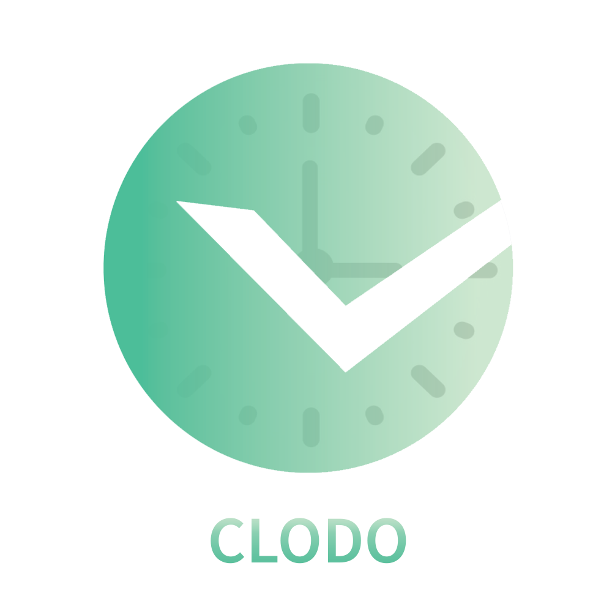

<!-- PROJECT LOGO -->
 

    
  
<h1 align="center">Welcome to Clodo Exp-Manager 👋</h1>
  

  

## 🚀 Description 
Clodo Exp-Manager is known as Clodo Expense Manager,It has been Developed by trekcodes for Public.

## Demo 

  

## Usage

You Can Manage Your Daily Expenses.
You Can Store Your Secret Notes.

# Upcoming Feature
- Adding Security
- Cloud Access
- Password Manager
- Support's IOS / Android / Web / Linux

## Windows Download

  

## 📝 License

Copyright © 2022 [TrekCodes](https://github.com/trekcodes). 
This project is BSD 3-Clause(https://github.com/TrekCodes/ClodoExp-M/blob/main/LICENSE) licensed.
